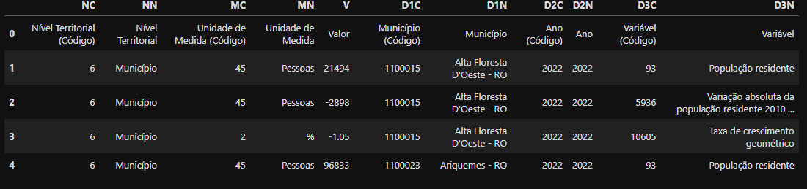
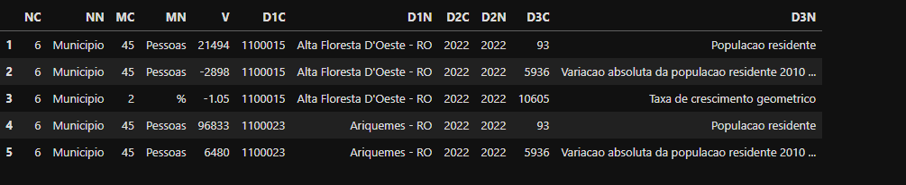
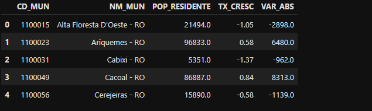
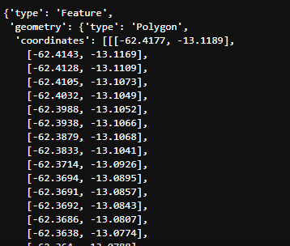
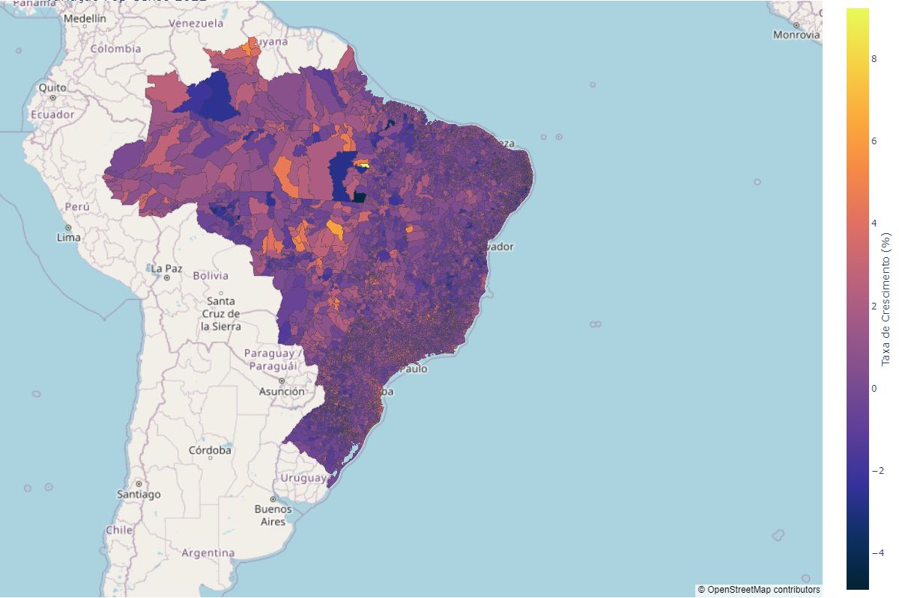
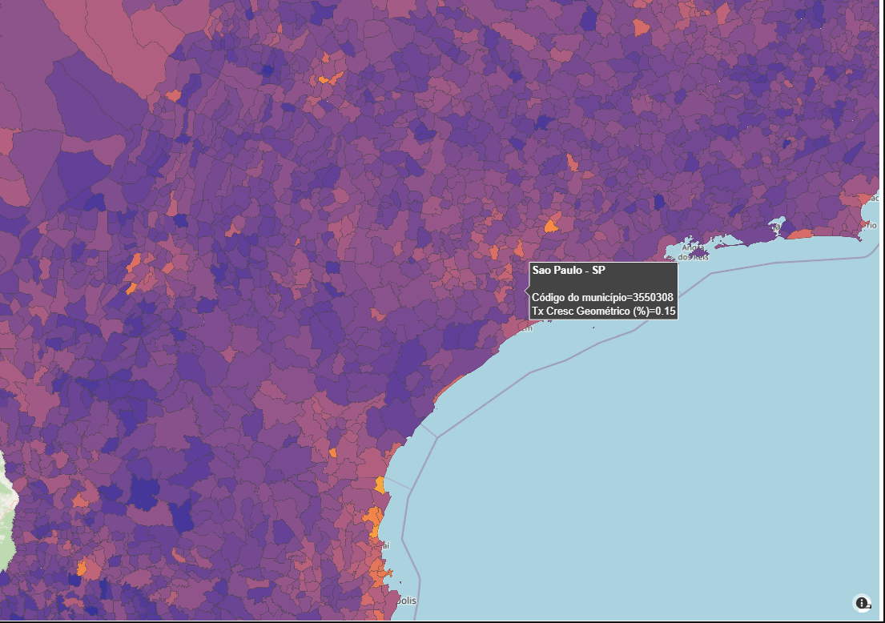

# Estudo censo 2022 IBGE - Gráfico de Crescimento Populacional

## Sobre
A ideia desse projeto surgiu quando descobri que o IBGE disponibilizava publicamente os dados do censo realizado a cada 10 anos. Além disso, eles oferecem uma API com suporte para Python, o que facilita a importação dos dados para dentro do código.

---

## Dados
A tabela é importada por meio de uma função da biblioteca `sidrapy` chamada `.get_table()`. Com os parâmetros corretos, conseguimos de forma simples trazer a base para o trabalho.

```python
  import pandas as pd
  import sidrapy

pop = sidrapy.get_table(
    table_code='4709',               # t (table_code) - é o codigo da tabela no site da sidra IBGE;
    territorial_level='6',           # n (territorial_level) - especifica os niveis territoriais;
    ibge_territorial_code='all',     # n/ (ibge_territorial_code) - inserido dentro do nivel territorial, especificar o codigo territorial do IBGE;
    period='all',                    # p (period) - utilizado para especificar o periodo;
    variable='all',                  # v (variable) - para especificar as variaveis desejadas;
)
```
### Output:


---

## Tratamentos
Como é possivel perceber, a tabela vem com os dados em uma estrutura um pouco diferente e que dificulta o entendimento, as colunas tem nomes que não fazem muito sentido, aqui vão as transformações realizadas
### Removendo acentos
```python
# Removendo acentos para facilitar o estudo
pop = pop.apply(lambda x: x.str.normalize('NFKD').str.encode('ascii', errors='ignore').str.decode('utf-8') if x.dtype == 'object' else x) # EsSa função é aplicada em todas as linhas do tipo object do data frame
# Removendo primeira linha
pop = pop.iloc[1:] # removemos a linha com indice zero que não é uma legenda dos dados

pop.head()
```
### Output:


### Pivotando a tabela - transformando os valores unicos de D3N em colunas 
```python
# Converta a coluna 'V' para numérico, forçando erros a serem convertidos para NaN
pop['V'] = pd.to_numeric(pop['V'], errors='coerce')

# Pivotando tabela
pop = pop.pivot_table(index=['D1C', 'D1N'], columns ='D3N', values = 'V').reset_index()
pop.columns.name = None

print(pop.shape)
pop.head()
```
### Output:


### Renomeando as colunas
```python
# Dicionário para mapeamento das colunas
column_mapping = {
    'D1C': 'CD_MUN',
    'D1N': 'NM_MUN',
    'Populacao residente': 'POP_RESIDENTE',
    'Variacao absoluta da populacao residente 2010 compatibilizada': 'VAR_ABS',
    'Taxa de crescimento geometrico': 'TX_CRESC'
}

# Renomeando as colunas
pop.rename(columns = column_mapping, inplace=True)
pop.head()
```
### Output:


---

## GeoJSON
Um dos parâmetros essenciais da função do Plotly para gerar o mapa é o geo_json, que contém os dados de delimitação dos territórios. Esses dados, já tratados para todo o território brasileiro, foram coletados do GitHub da FEA.dev USP.
```python
# Lendo o arquivo JSON com a delimitação de cada municipio para o plot do gráfico

with urlopen('https://raw.githubusercontent.com/fea-dev-usp/IBGE/master/geojson_2022.json') as response:
    geo_json = json.load(response)

geo_json['features'][0]
```
### Output:


---

## Plot do Gráfico com plotly
Para plotar o mapa de calor dos municípios brasileiros com base na taxa de crescimento populacional, utilizei a biblioteca Plotly, que oferece suporte robusto para esse tipo de visualização. O código do plot com a configuração do layout e parâmetros assim com o resto de todo o código do trabalho está disponivel no notebook deixado nesse repositorio.




---
## Conclusão
Este projeto foi uma excelente oportunidade para treinar manipulação de dados, trabalhar com chamadas de API utilizando a biblioteca sidrapy e aprender a criar visualizações interativas com o Plotly.

# FIM !!!
